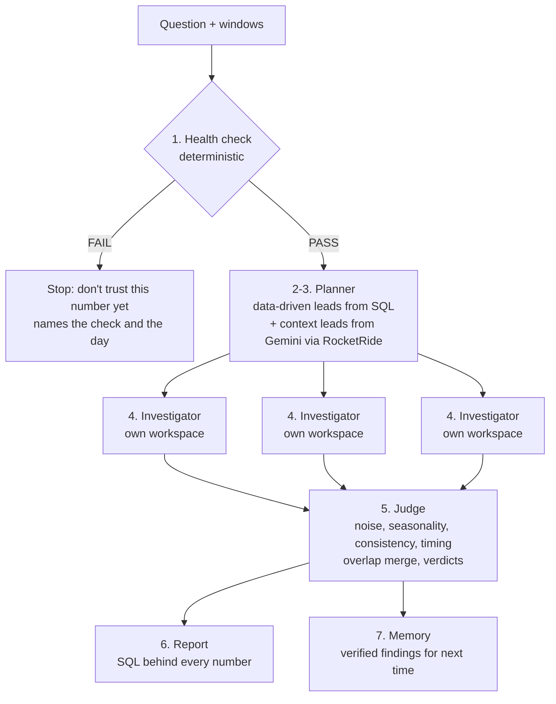

# Causal Crew

**Is the number real? If yes, every lead gets its own investigator — and the evidence decides.**

When a business metric moves ("revenue dropped 14% in two weeks — why?"), two very
different things can be true:

1. **The number is wrong.** A day loaded twice, a feed stopped, cents became dollars.
   The business is fine; the dashboard is lying.
2. **The number is right.** Something real happened, and finding it means following
   several leads — a region, a channel, a pricing change — each needing its own deep
   drill-down. Done by hand, that takes days, and whoever investigates anchors on the
   first plausible story.

Causal Crew checks the number first and **stops** if it can't be trusted. If it can,
every lead gets an independent investigator with its own isolated database, and a
deterministic judge compares the evidence on equal footing. Verified findings become
memory for the next question.

It does **attribution, not causal proof**: which segments account for the change, by
how much, and what context lines up with it.

## How it works



| Stage | Module | What it does |
|---|---|---|
| 0. Question | `causal_crew/question.py` | Relative periods ("last two weeks") are computed in code. Other phrasings are read by Gemini via RocketRide and validated against the data. Users can also set the dates. |
| 1. Health check | `causal_crew/health.py` | Freshness, row counts (robust z + relative floor), duplicate order ids, days copied under new ids, null spikes, unit/scale breaks. Any failure stops the run. |
| 2-3. Planner | `causal_crew/planner.py` | The largest single-dimension deltas always become leads (SQL). Changelog notes whose title names a segment always become leads too. Gemini, run as a RocketRide pipeline, fills the remaining slots using nearby notes and prior findings. |
| 4. Investigators | `causal_crew/investigator.py`, `workspace.py` | One per lead, in parallel, each in its own database: size the lead, drill down two levels, find the change point, split volume from order value, match context. At each level the investigator's own RocketRide pipeline task chooses the path among sub-segments that pass a statistical threshold. Every query is logged. |
| 5. Judge | `causal_crew/judge.py` | Deterministic evidence checks, overlap merge, ranking, verdicts. The LLM never writes a verdict. |
| 6. Report | `causal_crew/run.py` | Markdown + JSON, with the SQL behind every number. |
| 7. Memory | `causal_crew/memory.py` | Supported findings are appended to `memory/findings.jsonl` and fed to the planner next run; optionally pushed to Cognee (`--remember`). |
| Web app | `causal_crew/web/` | FastAPI and a single-page dashboard: ask a question, watch the pipeline and the investigator crew, read a plain-English answer built only from the judge's output, then drill into findings, data health, leads, memory, and SQL. Past runs are kept in history. |
| LLM layer | `causal_crew/llm.py`, `rocketride_llm.py` | RocketRide first, Gemini direct as backup, per agent. Each call is its own RocketRide task with a unique project id. |

Every threshold lives in [`causal_crew/config.py`](causal_crew/config.py).

## The demo

The data is **synthetic, with a planted cause** — see [PLANTED_CAUSE.md](PLANTED_CAUSE.md).
The West region's flat shipping fee rises from $4.99 to $8.99 on 2026-08-27; West orders
fall ~34%, concentrated in new customers. A decoy (the annual summer email campaign
ending two days earlier) dips email orders in every region — and did the same last year.

```bash
make setup     # venv + dependencies
make data      # generate 637k orders (+ a broken copy) and verify the planted story
make test      # unit tests + lint, no network
make app       # the dashboard at http://localhost:8000
make demo-a    # Run A: broken data
make demo-b    # Run B: clean data
```

**Run A — a day loaded twice.** The health check fails on row counts (+73%, |z| = 28.7)
and duplicate order ids, both naming 2026-09-03, and the run stops.

**Run B — clean data** (revenue −14.4%):

| # | Lead | Final segment | Share of change | Verdict |
|---|---|---|---|---|
| 1 | West | West, new customers | 58.9% | **SUPPORTED + CONTEXT_LINKED** — change point 2026-08-27, same day as the fee note; volume explains ~100% |
| 2 | Email | Email | 16.4% | **REJECTED (seasonality)** — the same windows last year dropped 87% as much |
| 3 | New customers | West, new customers | — | **MERGED into West** — the same lost orders |
| 4 | Web in West | West, web | — | **MERGED into West** |

## Design decisions

- **Deterministic core, LLM at the edges.** Health checks, drill-downs, statistics, and
  verdicts are plain Python over SQL, with unit tests. The LLM proposes leads and writes
  hypotheses; it never produces a number or a verdict. Its output is validated against
  real dimension values before use.
- **Context can't decide which leads exist.** The largest data deltas are always leads;
  Gemini only adds to them. Otherwise a misleading changelog note could steer the whole
  investigation.
- **Isolation per investigator.** Each lead gets its own database with a private copy of
  the data and its own scratch tables, and sees only its own lead. Findings can't bias
  each other and each one is auditable on its own. The `Workspace` class is the seam:
  today it's a local DuckDB file per lead; Hotdata instant databases with one
  `fork` per investigator are the drop-in upgrade (signup required a credit card at
  the event).
- **The health gate must not flag real business moves.** Robust z alone flags the real
  West drop (|z| = 6.2 on a −16% day). A day is flagged only when it is both statistically
  unusual *and* more than 25% off the trailing median — a doubled or missing day always is.
- **The LLM proposes the path; statistics dispose.** A sub-segment qualifies for a
  drill-down only if its share of the change is ≥1.25× its share of baseline revenue
  (otherwise the investigator would always descend into the biggest bucket). The
  investigator's LLM chooses among qualifying sub-segments and explains why; an
  unsupported choice is overridden by the rule, an outage falls back to it, and a
  rationale that cites a number not in the evidence is withheld. The report records
  who decided each level.
- **Statistics that fit revenue.** The bootstrap resamples days, not orders (resampling a
  fixed number of orders can't see volume changes). Seasonality compares percent changes,
  so year-over-year growth doesn't shrink last year's effect. Consistency requires
  sub-segments holding ≥80% of baseline revenue to move with the aggregate — the guard
  against Simpson's paradox. Overlap is measured on lost orders.
- **Graceful degradation.** The planner tries Gemini via RocketRide, then Gemini
  directly, then a keyword match on changelog titles; the report names which one
  answered. Cognee is opt-in. The demo never depends on an LLM being up.
- **Dates are arithmetic, not language.** Relative periods are computed in code. Asked
  for "the last two weeks", an LLM once returned 15-day windows, which silently shifted
  every number downstream. The LLM only reads phrasings the rule can't, and its dates
  are validated against the data.
- **No secrets in the repo.** `pipelines/planner.pipe` holds a `${ROCKETRIDE_GEMINI_KEY}`
  placeholder that RocketRide fills at run time; keys live only in `.env`.

### Verdict rules (`judge.verdict`)

| Condition | Verdict |
|---|---|
| Noise, seasonality, or consistency fails | `REJECTED (<failed checks>)` |
| All pass and share of change ≥ 30% | `SUPPORTED`, plus `CONTEXT_LINKED` if a note lands within ±3 days of the change point |
| All pass, share < 30% | `INSUFFICIENT_EVIDENCE` |
| > 50% of its lost orders sit inside a stronger finding | `MERGED into <lead>` |

## Architecture & Tools

| Tool / Layer | Role here |
|---|---|
| **RocketRide** | Runs every agent's LLM step on the staging server, each as its own task with a unique project id: the planner (`pipelines/planner.pipe`) and each investigator's drill-down decisions (`pipelines/investigator.pipe`). The fan-out itself runs in Python threads. |
| **DuckDB workspaces** | One isolated database per investigator (`workspaces/{lead_id}.duckdb`), each with its own copy of the data and its own scratch tables, so agents never share state. |
| **Hotdata** | Designed in behind the `Workspace` interface (one forked instant database per investigator); not live because signup needed a credit card at the event. |
| **Cognee** | Changelog notes loaded into a knowledge graph (`scripts/ingest_context.py`); verified findings can be pushed back with `--remember`. |
| **Snyk** | Dependency scanning (`make scan`): the 34 core dependencies have no known vulnerabilities. Static analysis (`snyk code test`): 8 medium DOM-XSS warnings, all on the dashboard's `innerHTML` rendering, where every value is escaped first. See Security. |

## Security

- **Dependencies (Snyk).** `make scan` tests the 34 core dependencies: no known
  vulnerabilities (2026-09-11).
- **Cognee is isolated as an optional extra** (`requirements-cognee.txt`,
  `make setup-cognee`). Snyk reports 5 issues in cognee 1.5.4 and its dependencies,
  none with a fixed version yet: arbitrary code injection in cognee (critical),
  deserialization of untrusted data in diskcache (high), and session and
  authentication issues in litellm's proxy server (high, medium). The demo and the
  dashboard never import cognee. It loads only in `scripts/ingest_context.py` and
  `run --remember`, both opt-in and run on our own changelog notes, and the litellm
  proxy server is never started.
- **Secrets** live only in `.env`. Pipeline files hold `${ROCKETRIDE_GEMINI_KEY}`
  placeholders, and commits were scanned for key material before every push.
- **LLM output is untrusted input.** Replies are parsed as JSON or as Python literals
  (`ast.literal_eval`), never executed. Planner leads are validated against real
  dimension values, investigator path choices against the statistical threshold,
  rationales that cite a number not in the evidence are withheld, and the dashboard
  HTML-escapes all LLM text.
- **SQL.** Dimension names are checked against config; values are always bound as
  parameters.
- **Static analysis.** `ruff` runs in CI. `snyk code test` reports 8 medium DOM-XSS
  warnings, all where the dashboard builds HTML with `innerHTML`. Each is a value that
  passes through the page's escaping helper first, which Snyk's taint analysis can't
  follow; the two error paths that carried a message were rewritten to use `textContent`
  so nothing from the network reaches `innerHTML` there. They are tracked, not ignored.

## Limitations

- Revenue is the only metric, and the data is one synthetic orders table. Connecting a
  warehouse or uploading a CSV is the next step.
- Attribution, not causation. A SUPPORTED finding means the evidence is consistent and
  large; it does not rule out an unobserved driver.
- Investigators' SQL runs locally in isolated DuckDB workspaces; only their LLM steps run
  on RocketRide.
- LLM path choices are limited to sub-segments that pass the concentration threshold,
  by design: the LLM can't steer an investigation down a statistically unsupported path.
- Gemini's free tier allows 20 requests per model per day, which bounds live runs and
  keeps Cognee off the live path.

## Layout

```
causal_crew/     pipeline modules; config.py holds every threshold
data/            demo data generator + verify_orders.py (checks the planted story holds)
context/         ten dated changelog / incident notes
pipelines/       RocketRide pipeline definitions
scripts/         environment smoke test, Cognee ingest
tests/           unit tests on deterministic fixtures (CI: .github/workflows/tests.yml)
```

## Setup details

Copy `.env.example` to `.env` and fill in `ROCKETRIDE_APIKEY` and `LLM_API_KEY` (Gemini).
`make check` smoke-tests every service. `make setup-cognee` adds the optional Cognee
memory integration; `make app` serves the dashboard at http://localhost:8000.
